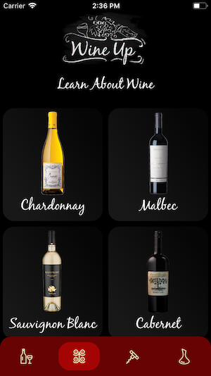

<h1 align="center">🧀 Welcome to WineUp, Your Pocket Sommelier 🍷</h1>

<p>
  
  <a href="https://twitter.com/jenlooper">
    
  </a>
</p>

## Featuring

🍷Daily Wine: a random wine selected from Azure table storage from wine reviews scraped from Wine Spectator Magazine

🍾Wine Educator: a list of wine types; select one to read about the top 5 highest-rated vintages

🧀Cheese Educator: a list of the six main types of cheese; select one to learn more

🍷🧀Cheese Imager: confused when that cheese tray is headed your way? Take a pic of a cheese, get educated on its type and get a suggested wine pairing



## Install

```sh
npm i
```

## Usage

Ensure that you have Android Studio and Xcode installed to run this app on mobile simulators. You will also need an instance of Firebase for running the custom model. Follow the instructions for running NativeScript's Firebase plugin [here](github.com/eddyverbruggen/nativescript-plugin-firebase).

This cross-platform mobile app is built with [NativeScript-Vue](http://www.nativescript-vue.org), running custom machine learning models built for TensorFlow lite and running on your device with the Firebase plugin referenced above. Data is sourced from Wine Spectator magazine as discovered via Kaggle, and stored in Azure table storage. The data is discoverable via an API built with Azure functions.

Azure functions are cool! Learn more about them [here](https://azure.microsoft.com/services/functions/?WT.mc_id=academic-0000-jelooper).

Need to build a custom machine learning model? If you source your own data, you can take a look at [the system I use](https://github.com/jlooper/models/tree/master/research/slim#Custom) to train a quantization-aware custom machine learning model. Quantization is required by the aforementioned Firebase plugin. This fork of TensorFlow's research models has been sent to TensorFlow as a PR; for the moment, you can use these scripts.

How about the data behind the model? If you want to create your own, you can take short movies of objects and break the files apart into images. Use the [FFMPEG library](https://ffmpeg.org/) to do this:

```sh
ffmpeg -i movie.mov -vcodec copy -acodec copy out.mp4
ffmpeg -i out.mp4 img_%04d.jp
```

The slide deck explaining this project is [here](https://microsoft-cloud-advocates.slides.com/jenlooper/wineup)

```sh
tns run ios
```

or

```sh
tns run android
```

## Author

👤 **Jen Looper**

-   Twitter: [@jenlooper](https://twitter.com/jenlooper)
-   Github: [@jlooper](https://github.com/jlooper)

## Show your support

Give a ⭐️ if this project helped you!

---

_This README was generated with ❤️ by [readme-md-generator](https://github.com/kefranabg/readme-md-generator)_
